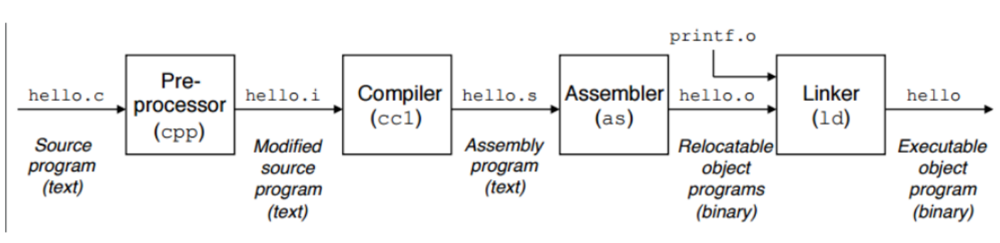

# Lab x86-64 Assembly Cycle Count Tool

> "Nearing Machine Code Representation"



## Introduction

Recall that our compilers translate our C code to assembly which is the human readable version of binary(1's and 0's). You may be wondering how good are compilers (like gcc and clang) at generating assembly from our C code (Similar to the way you may have a good and bad translator when communicating in different languages)? How can we be sure that our compiler is generating efficient assembly? There are afterall, many different ways to write a program that generates the same output!

## Our Tool

Part of being a good programmer is to analyze your programs that you write and answer questions about them. A question you might want to ask someday is "how efficient is my code". Today we are going to build a tool that provides a *rough approximation* of how many 'cycles' our assembly code takes to execute, and how many instructions are in total. You are going to write a small parser in C that opens a file (from a command line argument), and then counts how many instructions are needed to run that program from top to bottom.

As an example, if an assembly(.s) program had the following code:

```asm
# assembly.s program

MOVQ a, %rax
MOVQ b, %rbx
ADDQ %rbx, %rax
IMULQ %rbx
MOVQ %rax, c
```

**Your goals**: Your [tool.c](./tool.c) will report a summary of the total Instructions(i.e. ADD, MOV, MUL (i.e. IMULQ), etc.) found given an input file. Additionally, you will estimate the total cycles needed for hardware to execute this code.

Below is an example of a correct output your program -- You should report each individual instruction (i.e. ADD, MOV, MUL(note IMUL i equivalent to MUL)) and how many times that command appears. Then report a summary of the total instructions, and the total number of cycles.
```asm
ADD 1
MOV 3
MUL 1

Total Instructions = 5
Total Cycles = 6
```

## Specifications for tool.c

* Your tool should read in a file name through the command line arguments for what file is being analyzed 
  	* You will run your program with: `./tool barbones.s` on the command line where 'barebones.s' is the program being analyzed.
		* [barebones.s](./barebones.s) is provided to be used as an example input file for your tool.
* You will create from scratch a file called [tool.c](./tool.c) which you will implement your tool in. 
  	* Your [tool.c](./tool.c) will read in one line of the input (from an assembly file like barebones.s) at a time.
  	* You will read in the first 3 to 4 characters of that line, and determine the instruction that was read in.
		* At the very least, your program should report on: ADD, SUB, MUL, DIV, MOV, LEA, PUSH, POP, and RET instructions.
  			* i.e. For your analysis (and for the sake of simplicity), consider ADDQ, ADDB, ADDL, etc. each as adding to the 'ADD' instruction and cycle counts. 
  			* IMUL is equivalent to MUL
  			* IDIV is equivalent to DIV.
    			* You may ignore other assembly instructions (i.e. INCQ, DECQ that are not in the above list)
		* Assume that the instructions could be either all uppercase, all lowercase, or some combination. Consider how you may want to write your code, such that you could 'convert' characters to a specific case (upper or lower), and then check which instruction was read in.

### Full instruction table and the corresponding instruction count, and the total cycles.

|Instruction Name | Total Instructions  | Total Cycles   |
|---|----|---|
|ADD| 1  | 1 |
|SUB| 1  | 1 |
|MUL| 1  | 2 |
|DIV| 1  | 4 |
|MOV| 1  | 1 |
|LEA| 1  | 1 |
|PUSH| 1 | 1 |
|POP| 1  | 1 |	
|RET| 1  | 1 |	

### Reading in arguments in C - argc and argv

We have used some programs at this point like GDB and valgrind that take in arguments. In fact, our compiler 'gcc' (or 'clang') take in arguments as well. So how do those programs read in arguments from the command line?

Here's an example program for working with arguments in C.

```c
// Compile with: gcc -g -Wall args.c -o prog
// Try running with:
//          - ./prog
//          - ./prog somefile.s
//          - ./prog "some file name with spaces surrounded by quotes.s"
//          - ./prog argv1 argv2
#include <stdio.h>

// The parameters to the main function are read in
// when you execute your program on the terminal.
// argc: is the argument count
// argv: is a 'variable' number of arguments provided
//
// This program shows how to iterate through all of the arguments
int main(int argc, char** argv){

    printf("argc is the argument count: %d\n",argc);
    
    // This loop will print out all of the arguments
    for(int i=0; i < argc; i++){
        printf("argv[%d] is %s\n",i,argv[i]);
    }

    // Then you can use the argv's as needed.
    // example: If argv[1] is suppose to be a particular (like the filename), 
    //          you can make use of it.
    // 		So your next step would be to use FILE* input = fopen(argv[1],"r");
    //		Then read every line in that file, and 'parse' the first few characters

    return 0;
}

```

### String processing and file processing

We have worked with string functions in string.h, and you may use any that you find helpful in your solution.

Additionally, I have provided an example snippet below to help with reading in data from a file.

```c
// gcc -Wall -g readfile.c -o prog
// ./prog
#include <stdio.h> // Used for input/output (including file operations)
#include <stdlib.h>

int main(){

	// FILE is a typedef in stdio.h
    // FILE is actually a very simple structure, representing
	// a 'handle' to a file on your system.
	// In practice, this is just an 'integer' value.
    FILE* myFile;

	// Now, we want to actually assign our myFILE to open
	// some data on our machine.
    myFile = fopen("./barebones.s","r");
    // We point our file pointer to a file
    // The filepath is 'relative' to where we are
    // i.e. the './' means start searching for files here in
	//      the current directory

    // We should check if we successfully opened the file next.
    // Because this is a 'file pointer' we can check if the
    // operation was successful against NULL.
	// A file might be NULL if the file does not exist, or if the
	// path is wrong for instance.
    if(NULL == myFile){
		// fprintf is new--it essentially let's us control where
		// we output text--as opposed to always writing to the
		// terminal. This will also write to the terminal, but 
		// to a special 'error output'
        fprintf(stderr,"barebones.s not found\n");
        fprintf(stderr,"note: stderr argument means we write to a special 'error' output stream.\n");
        fprintf(stderr,"Program terminating now...\n");
        exit(1);
    }

    // If we have successfully opened our file, we can now read each line.
    // We will read each line, until we reach the end of the file (EOF).
    char buffer[255]; // At most, we assume each line in file can
					  // be 255 characters at the most.
    // So we will now can each line from a file(fscanf),
    // and store it as a character string(%s) in buffer each iteration.
    // Note: This will read each individual 'token'.
    //       Maybe this is what we want to do? Or maybe not, depends on the task!
    while(fscanf(myFile, "%s", buffer) != EOF){
        printf("token: %s\n",buffer);
    }

    // Let's try another command to read each line one at at time
    // This time we'll use 'fgets' which gets one 'string' (i.e. one line)
    // at a time in our buffer.
    // Before we start reading in lines from our file, we have to reset
    // the position however.
    // That is--we seek to the beginning, so our 'C file functions' can
    // read the 'myFile' pointer from the start.
    fseek(myFile,0,SEEK_SET); // Read more about fseek in the 'man fseek'
    while(fgets(buffer,255,myFile)){
        printf("line: %s",buffer);
    }

    // Finally, we will close our file
	// Now our file is unavailable to be read from.
	// Generally, it is safe 
    fclose(myFile);

    // Okay, now you should have some idea of how to read and process
    // data from a file that exists on your system!

    return 0;
}
```

* You may find [https://fresh2refresh.com/c-programming/c-strings/c-strcat-function/](https://fresh2refresh.com/c-programming/c-strings/c-strcat-function/) helpful for learning some string processing in C or here: [https://www.programiz.com/c-programming/c-strings](https://www.programiz.com/c-programming/c-strings)
* The overall approach is to read one line at a time from the file you have loaded, read the first 3 characters, and then appropriately update your total instructions and total cycles.
* There are many helpful functions such as fgets, fscanf, scanf, fgetc, getc
 
# More on strategy

This is the first assignment where you don't have any starter code. Think about how you might want to approach the project first before you start coding. What data structures do you think you'll need? What functions can you use to appraoch this problem. Try something simple first before adding complexity. And remember to save, compile, and run often (and then git add/commit/push often!)

# Resources to help

- [http://www.cplusplus.com/reference/cstring/](http://www.cplusplus.com/reference/cstring/)
- Matt Godbolt has written a great tool to help understand assembly generated from the compiler. 
  - https://godbolt.org/

# Feedback Loop

(An optional task that will reinforce your learning throughout the semester)

* (Optional for fun) You do not need to do anything with barebones.s in this assignment, but you can investigate or answer the qeustions in the file for extra assembly practice.
* (Optional for fun) Try running barebones or another assembly program after compiling with -O0 and -O3 and see if the cycle count changes from your tool.
* (Optional) Use the Agner Fog's instruction table ([http://www.agner.org/optimize/instruction_tables.pdf](http://www.agner.org/optimize/instruction_tables.pdf)) to find more accurate cycle counts how many cycles the program will run. That is, take an instruction like MOV which typically takes 1 cycle, and sum them together and output the result.
  * You will use the **Nehalem** Intel architecture to find your values.
  * Note that this is again an estimate (MOV with different data types itself takes different number of cycles! So your answer will be an approximation. I am expecting there to be some variance, even within the class--attempt something reasonable).
