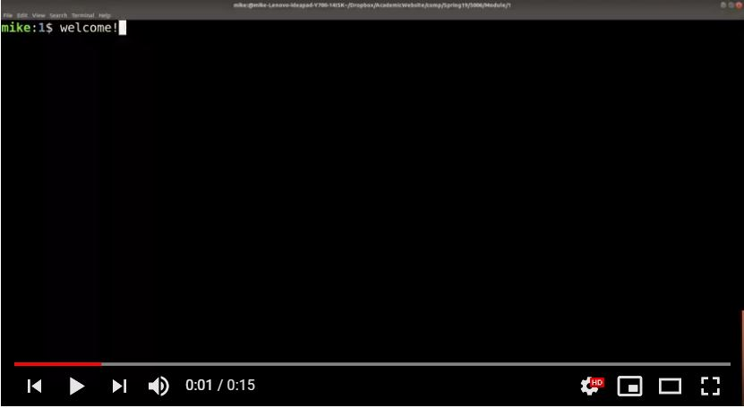

# Terminal Overview

> "Name 10 terminal commands"

That was a prompt I was given when interviewing for LinkedIn several years ago, and that was not the first time someone had asked me about the terminal at an interview! It's not that you should memorize 10 terminal commands, but rather you should understand that working on the terminal is an essential skill.

In this lab, you are going to perform a few terminal commands to get familiar with the Unix Environment along with some other standard tools used throughout this course (and that you will use in your career!).

### Video tutorial of Lab 1

For this first lab, a video tutorial will be provided because there can be so many new tools/infrastructure being introduced. 

Try your best to work through the lab during class time, but if you get stuck you can follow along the video later on. Remember, labs are due at the start of class the following week--so you get one week to submit your lab. You and your partner should both make individual submissions.

**Playlist starts here!**
https://www.youtube.com/watch?v=HjZVOWAGgZQ&list=PLvv0ScY6vfd8qupx0owF78ZcbvySvbWfx

## Parts to the lab

- [part0.md - Make sure you are in this repo](./part0.md)
- [part1.md - ssh and cloning your repo ](./part1.md)
- [part2.md - The 10 commands](./part2.md)
- [part3.md - Learn C](./part3.md)
- [part4.md - The Network is down! How to work locally](./part4.md)

## Deliverable

* Copy and Paste the output from the command-line interface of you running five different terminal commands above into a file called "output.txt" (no capitalization, exactly as named.)
  * Make sure to 'add/commit/push' this file to the repo in this directory.
* Modify the file called 'main.c' in your respository containing the power example.
  * Make sure to 'add/commit/push' this file to the repo in this directory.
* Take a screenshot of your virtual environment running. Name it 'linux.jpg'
  * Make sure to 'commit' this file to the repo in this directory.

## Going Further

(Some more terminal programs to research and try out on your own time)

1. history
2. tree
3. touch
4. awk
5. sed
6. tee
7. ps
8. top 
9. grep
