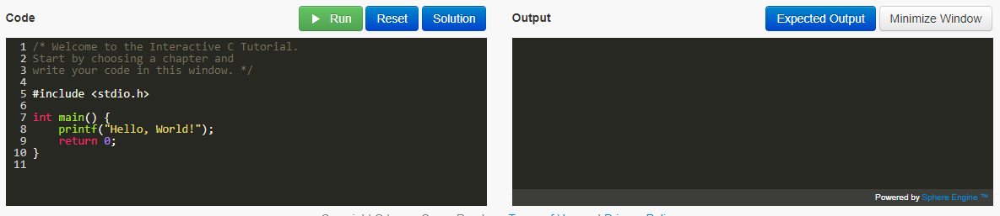

## Part 3 - Learn-C

The main programming language we will be using in this course is "C".

Complete the 'Learn the Basics' section of the C tutorial on the web from http://www.learn-c.org/
(If for some reason learn-c.org is down, run through the examples provided in the slides)

- [Hello, World!](http://www.learn-c.org/en/Hello%2C_World%21)
- [Variables and Types](http://www.learn-c.org/en/Variables_and_Types)
- [Arrays](http://www.learn-c.org/en/Arrays)
- [Multidimensional Arrays](http://www.learn-c.org/en/Multidimensional_Arrays)
- [Conditions](http://www.learn-c.org/en/Conditions)
- [Strings](http://www.learn-c.org/en/Strings)
- [For loops](http://www.learn-c.org/en/For_loops)
- [While loops](http://www.learn-c.org/en/While_loops)
- [Functions](http://www.learn-c.org/en/Functions)
- [Static](http://www.learn-c.org/en/Static)

Once you are comfortable write a C program on the Khoury machines in the file **main.c**.

1. The program will contain a function with the signature 'double power(double base, double n)'.
2. Your program will call this function in a loop in the main function, computing the first power(2,1) to power(2,10) and print out these results to the terminal.
	- Note: Your power function only needs to handle positive values.  
3. You can compile your program with: `clang main.c -o prog` or ``gcc main.c -o prog`` to see if it works. 
	- You will then type `./prog` to run the program.

Here is a little tutorial on VIM as a resource: https://www.howtoforge.com/vim-basics.

Note: I use VIM, and have limited knowledge of other editors, but you are free to use what you like. You really should commit to using VIM or emacs for this course--it will serve you well professionally (In practice, you should know one terminal editor very well (Vim or emacs), one text editor very well (sublime, atom, etc.), and one IDE well (Visual Studio, XCode, Netbeans, etc.)).

## More resources to help

- If you are not comfortable with compiling a C program on the terminal, take a look at this resource: https://www.cs.fsu.edu/~myers/howto/g++compiling.txt
