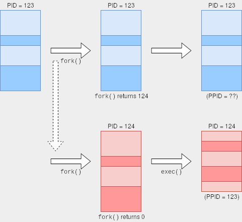

**README: For this lab, I recommend completing it locally or on an instance of virtual box. That means doing a new 'git clone' on virtual box or locally, and then completing the exercises, and making sure to 'git push' your changes.**

# Process API

In today's lab, we are going to explore the [C process API](https://www.gnu.org/software/libc/manual/html_node/Processes.html) to get familiar with process control. Part of today's lab will also be about creating and launching processes using the [C process API](https://www.gnu.org/software/libc/manual/html_node/Processes.html), which will prepare you for building your own shell.

Provided in this lab are several code examples showing several ways to launch and control processses with the commands: [fork](https://www.gnu.org/software/libc/manual/html_node/Creating-a-Process.html), [wait](https://www.gnu.org/software/libc/manual/html_node/Process-Completion.html), and [exec](https://www.gnu.org/software/libc/manual/html_node/Executing-a-File.html). Today's lab will also introduce you to the idea of 'multiprocessing' (i.e. executing multiple processes) as well as some of challenges in correctly executing multiple programs.

## Fork and Exec Motivation and Use


The [fork](https://man7.org/linux/man-pages/man2/fork.2.html) command serves as a mechanism for creating new processes in the operating system. The mechanism for creating a new process, is by duplicating the current running process. At first, this is going to seem a little strange (But it's actually a [very efficient way to create a new process](https://stackoverflow.com/questions/32130868/does-fork-duplicate-all-the-memory-of-the-parent) by just duplicating it). However--the new copy process (which we refer to as the 'child process' forming a parent-child relationship) is almost exact duplicate copy of the current running process (The child process id is different than the parent as one example).

At this point we have two separate programs that are executing. 




But you might wonder, how do we get a 'new' application that can do something different? This is where the [exec](https://man7.org/linux/man-pages/man3/exec.3.html) function is used. We can call the [exec](https://man7.org/linux/man-pages/man3/exec.3.html) function (really a system call) from our child process and the 'exec' function replaces that current program by loading up (or overlaying) a new process (thus we no longer have a duplicate process--but a totally new program running).

(Notice after the 'exec' call the boxes change size, because 'exec' is allocating a new program)

When thinking about this from the perspective of an operating system, [fork](https://man7.org/linux/man-pages/man2/fork.2.html) is a quick way to create a new process, and [exec](https://man7.org/linux/man-pages/man3/exec.3.html) allows us to execute a totally new program in a separate address space safely (thus, not effecting our original parent process in the case where the child crashes).

# Part 1 - fork

Remember that when we use [fork](http://man7.org/linux/man-pages/man2/fork.2.html), we are creating a child process that is nearly identical to the parent process. The child process gets a copy of (almost) everything that the parent had, but the memory is distinct, such that modificiations in either the parent or child do not effect each other.

Let us go ahead and try a first example with fork.

### example1.c - Understanding fork()

The following program is our version of a "hello world" to the fork command you may enter in [example1.c](./example1.c).

```c
#include <stdio.h>
#include <sys/types.h>	// Includes some new data types (e.g. pid_t)
#include <unistd.h>	// This is a new library that includes various unix system calls.

int main(){
	alarm(180); // Please leave in this line as the first statement in your program.
              	    // This will terminate your program after 180 seconds,
                    // and is useful in the case that you accidently leave a bunch of running proceses.

	// Variable to store the process id
	pid_t pid;
	// Variable 'x' allocated on the stack
	int x = 1;

	// pid returns the child process id.
	// 0 if it is the child
	// >0 is the process id of the child which the parent recieves
	pid = fork();

	if(pid==0){
		// Note: pre-increment '++x' adds 1 to x before printing.
		printf("child: x=%d\n",++x);
		return 0;	
	}

	// Parent process executing
	// Note: The 'pre-decrement' '--x' subtracts 1 from x before printing
	printf("parent: x=%d\n", --x);

	return 0;
}

```

* Save and compile the code: `gcc example1.c -o prog`
* **Before running:** Predict what the result will be.
* Run the following program with: `./prog`

Your takeaway from the above program should be to recognize, that because a duplicate process was made, each process had its own value of 'x' that was being modified. The 'stack' that is part of each executing processes memory was duplicated, thus different x's were being modified in the child and parent process.

### example2.c - Foreground nad background processes

Let's try another example this time, type the following in [example2.c](./example2.c)

```c
#include <stdio.h>
#include <stdlib.h>
#include <sys/types.h>
#include <unistd.h>

int main(){
	alarm(180); // Please leave in this line as the first statement in your program.
              	    // This will terminate your program after 180 seconds,
                    // and is useful in the case that you accidently leave a bunch of running proceses.

	// Variable to store the process id
	pid_t pid;
	// Variable 'x' allocated on the stack
	int x = 1;

	// pid returns the child process id.
	// 0 if it is the child
	// >0 is the process id of the child which the parent recieves
	pid = fork();

	if(pid==0){
		printf("Terminating Child, PID= x=%d\n",getpid());
		exit(0);	
	}else{
    	    // Run the parent
	    printf("Running parent forever(pretend I am a server or long running process): pid=%d\n",getpid());
    	    while(1){
	    	// Work would be done here
    	    }
  	}

	return 0;
}
```

* Save and compile the code: `gcc example2.c -o prog`
* Run the following program: `./prog &` (Notice that the ampersand here is used)
* **Before running:** Predict what the result will be. What happens when you compile and run this code? 
	* (When running with `./prog &` the ampersand returns control back to shell and your process runs in the background until completion).

**What happened??**

Type `ps -ef | grep your_khoury_username` into the terminal (or try `ps -ef | grep prog` if your username is longer than 7 characters). When you execute with the '&' that will put your process into the 'background' so that you can continue to have that process execute and resume typing commands in your shell. Typing in 'fg' will move the background process into the 'foreground' so that you can then press <kbd>Ctrl+C</kbd> to terminate the process. Go ahead and terminate the process now.
  
### example3.c - Orphan processes

Let's run another example, but this time we'll run the processes in the foreground (no ampersand this time). In this code, what if we flip the scenario where our child runs forever and our parent terminates first?

Type the following in [example3.c](./example3.c)

```c
#include <stdio.h>
#include <stdlib.h>
#include <sys/types.h>
#include <unistd.h>

int main(){
    alarm(180); // Please leave in this line as the first statement in your program.
	        // This will terminate your program after 180 seconds,
	        // and is useful in the case that you accidently leave a bunch of running proceses.

    // Variable to store the process id
    pid_t pid;
    // Variable 'x' allocated on the stack
    int x = 1;

    // pid returns the child process id.
    // 0 if it is the child
    // >0 is the process id of the child which the parent recieves
    pid = fork();

    // Observe this time that the child runs in an infinite loop.
    if(pid==0){
    	printf("Running child forever now pid=%d\n",getpid());
    	while(1){
		// Work would be done here.
    	}
    }else{
	// Run the parent, and then shortly terminate it.
	printf("Terminating parent pid=%d\n",getpid());
	exit(0);
    }

	return 0;
}
```

* Save and compile the code: `gcc example3.c -o prog`
* Run the following program: `./prog &`

**What happened here**

We have a problem here--our parent terminated before our child process did. This creates what is known as a 'orphan process'. You can read about [zombie and orphan processes here](https://www.geeksforgeeks.org/zombie-and-orphan-processes-in-c/). If you run the `ps` command again you should see an instance of `./prog` still running (Note: If you don't see the process, try `ps aux | grep your_user_name` or `ps aux | grep prog`).

Let us get rid of our process that is still executing now. Type `kill somenumber` where *somenumber* is the pid (process id) of your parent and child process as shown from the `ps` command (i.e. the PID). (Note: In general, when you kill a process, if you kill the parent process that should kill the child process as well. See the [kill](http://man7.org/linux/man-pages/man2/kill.2.html) system call. Kill sends a signal to terminate a process.).


## Synchronization

There is a sometimes subtle problem you may have noticed in the previous example(s) if you ran them enough times. We did not properly enforce the order in which each process executed. So what is one potential solution to fix this problem to ensure that the child process finishes before the parent?

The answer is to use a synchronization function called [wait](https://man7.org/linux/man-pages/man2/waitid.2.html). `int wait(int *child_status)` will make the parent process wait to execute after one or more child process(es) has finished.


### example4.c - Introducing wait

Type the following in [example4.c](./example4.c)

```c
#include <stdio.h>
#include <stdlib.h>
#include <sys/types.h>
#include <sys/wait.h> // Library with the 'wait' system call.
#include <unistd.h>

int main(){
    alarm(180); // Please leave in this line as the first statement in your program.
	        // This will terminate your program after 180 seconds,
	        // and is useful in the case that you accidently leave a bunch of running proceses.

    // Store the status here
    int child_status;

    // Another way to 'fork()' a child process without storing the pid
    // The parent process will begin executing from the else block.
    if(fork()==0){
        printf("Child runs!\n");
        exit(0); // and exits properly
    }else{
        printf("Hello from parent\n");
        wait(&child_status);

        // If we want to do something with the child_status here is an example.
        // Typically we can wait(NULL), but within our parent we may want
        // to capture how the child exited(maybe it exited with some error code).
        // e.g. change 'exit(0)' to 'exit(5)' in the block of code executed by
        // the child.
        if(WEXITSTATUS(child_status)>=0){
            printf("Child exited with the following child_status %d\n",WEXITSTATUS(child_status));
        }
        printf("Child always is terminated by this point--parent resuming\n");
    }

    printf("This always prints last\n");

    // It is important to note that our parent should always wait for all
    // of its child processes to exit before proceeding.
    // If the parent ends first(i.e. forgetting to call wait), the
    // child process is 'orphaned' and becomes a zombie process that
    // cannot be otherwise terminated.

    return 0;
}
```

* Save and compile the code: `gcc example4.c -o prog`
* Run the following program: `./prog`
* Take a moment to read about orphan and zombie processes here: 
	* http://linuxg.net/what-are-zombie-and-orphan-processes-and-how-to-kill-them/
	* Understand what we saw in example 3 we created an orphan.
	* Understand also how to find and kill any zombie and orphan processes.
	
### example5.c - Introducing exec

#### execve

Sometimes we will want to create an identical process with 'fork', but instead execute an entirely new program from our process--this is what a shell (i.e. our terminal where we enter commands (and by 'commands', I mean programs)) does. 

In order to execute other programs (i.e. a specific process), we have the [execve](http://man7.org/linux/man-pages/man2/execve.2.html) command.

- The execve command: `int execve(char* filename, char* argv[], char*envp[])`
- filename: This is the script or file we are going to execute (i.e. You can think of this as almost equivalent to typing a program name on the shell)
- argv: This is our argument list (which we are familiar with). 
	- As an example: argv[0] = filename of the program we want to execute
- envp: These are any specific environment variables we want to set.
  - More information can be found here: [https://en.wikipedia.org/wiki/Environment_variable]

Let's try a simple example using execve to launch the 'ls' program from within our program.

Type the following in [example5.c](./example5.c)

```c
#include <stdio.h>
#include <stdlib.h>
#include <sys/types.h>
#include <sys/wait.h>
#include <unistd.h>

int main(){
    	alarm(180); 	// Please leave in this line as the first statement in your program.
	        	// This will terminate your program after 180 seconds,
	        	// and is useful in the case that you accidently leave a bunch of running proceses.

	char* myargv[16];	// We can store up to 16 arguments.
	myargv[0]="/bin/ls";	// Our first argument is the program we want to launch.
	myargv[1]="-F";		// Any additional arguments (i.e. flags) we want to make use of.
	myargv[2]=NULL; 	// Terminate the argument list--similar to how we would terminate a character string.
				// (i.e. Set the last argument to NULL if we have no more flags.)
	if(fork()==0){
		// Executes command from child then terminates our process
		// Note: There are other 'exec' functions that may be helpful.
		execve(myargv[0],myargv,NULL);
		printf("Child: Should never get here\n");
		exit(1);
	}else{
		wait(NULL); // handy synchronization function again!
		printf("This always prints last\n");
	}
	
	return 0;
}
```

* Save and compile the code: `gcc example5.c -o prog`
* * **Before running:** Predict what the result will be. What happens when you compile and run this code? 
* Run the following program: `./prog`


### A Brief exercise

* Go ahead and modify the above code and try to run some other processes like 'cat'.
	* Will the code work if I change `myargv[0]="ls"`. Why do you think this is? What did you discover?
	* Some hints to the previous question
		* https://phoenixts.com/blog/environment-variables-in-linux/ 
		* https://www.cyberciti.biz/faq/linux-list-all-environment-variables-env-command/


**Folks who do this exercise will discover**, that there are many other variations of 'exec', and one of them will allow you to type out commands without having to specify the full absolute file path to program. That is, you can type `ls` **instead of** `/bin/ls` if you use the proper exec command for your homework. The proper 'exec' function will load 'environment variables' that store paths to common places where common programs are located (i.e. the /bin directory on linux), and search those paths to find programs to exec.


### example6.c - Interprocess Communication (Pipe and dup2)

Sometimes it can be handy to get multiple processes to talk to each other. [example6.c](./example6.c) has been provided for you to help your understanding of commands like pipe, dup2, exec, waitpid, and close.

You will also learn about file descriptors by reading through [example6.c](./example6.c).

**Hint understanding** [example6.c](./example6.c) and [example5.c](./example5.c) will be **very useful** if you wanted to implement your own a shell.

# Your task - myprogram.c

Now that you have learned how to use fork(), exec(), and wait() you will write your own program utilizing these system calls.

### Task

- Write a program in [myprogram.c](./myprogram.c) using fork and/or execve to execute a series of at least 3 other commands/programs.
	- As an example, your program would run: `ls`, followed by `echo "testing"`, and then `nl example1.c`
		- You are welcome to launch a different set of programs and be as creative as you like! 
	- [example5.c](./example5.c) is a program that executes exactly 1 command, and you may expand on this example in your [myprogram.c](./myprogram.c) 
	- It may be useful to use [waitpid](https://linux.die.net/man/2/waitpid) if you'd like to wait on a specific process to execute (think about if the order matters however!)

# Optional material - Terminal Programs

To get some practice with understanding processes, run the following commands: 

- `ls proc/` (Why `ls` here? What if you just type `/proc`)
- [top](http://man7.org/linux/man-pages/man1/top.1.html)
- [ps](http://man7.org/linux/man-pages/man1/top.1.html)
- [kill](http://man7.org/linux/man-pages/man2/kill.2.html) (yes, I know it is a rather aggressive command name--yikes!)

It will be further useful to read the `man` pages for each of the commands.

# Lab Deliverable

- Commit the source code for the 5 examples (example1.c example2.c example3.c example4.c example5.c).
- Commit your source code for [myprogram.c](./myprogram.c)

# More resources to help

- https://www.networkworld.com/article/2693548/unix-viewing-your-processes-through-the-eyes-of-proc.html
- Stack overflow post on `kill` system call.
	- https://unix.stackexchange.com/questions/8916/when-should-i-not-kill-9-a-process
- On Interprocess Communication (i.e. pipe)
	- https://www.usna.edu/Users/cs/aviv/classes/ic221/s16/lec/18/lec.html
- Another useful tutorial on pipe, fork, etc.
	- http://www.rozmichelle.com/pipes-forks-dups/
	
# Going Further

- Investigate the different command shells: https://en.wikipedia.org/wiki/Comparison_of_command_shells

# F.A.Q.

1. Q: Which exec command should I use so I do not have to type in the absolute path (i.e. /bin/ls) of a program to execute it?
	* Do a little research here. One of the exec commands will use an environment variable named 'PATH' to search in directories for where a program exists.
	* i.e. You can see the PATH variable by echo'ing it out
		* `mike:~$ echo $PATH `
		* `/home/mike/.local/bin:/home/mike/bin:/usr/local/sbin:/usr/local/bin:/usr/sbin:/usr/bin:/sbin:/bin:/usr/games:/usr/local/games:/snap/bin`
		* This means that when you type in 'ls' it will look in the `/home/mike` then `./local/bin` and the `/home/mike/bin` directory, etc. until it finds a program named `ls` to execute.
3. Q: What is thed ifference between Zombie Process, Orphaned Process and Daemon Process
	* Zombie Process - a zombie process (same as `<defunct>`) is a process that has completed execution but still has an entry in the process table and this happens when the termination of the process has not been collected by the parent.
	* Orphaned Process - process whose parent process has finished or terminated, though it remains running itself. (example3.c)
	* Daemon Process - Daemon is a computer program that runs as a background process, every daemon process is an orphaned process.
